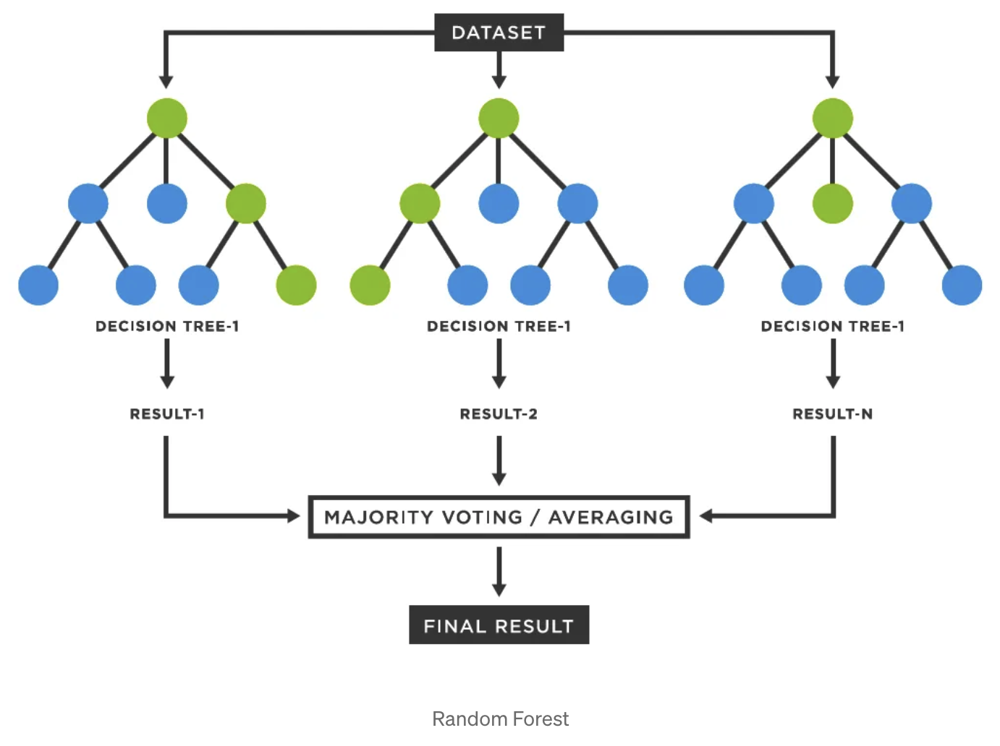

# Predictive Models for Heating and Cooling load Analysis: SVM, MLR, and Random Forest  

## Overview  

This project demonstrates the use of three powerful machine learning models—**Support Vector Machine (SVM)**, **Multiple Linear Regression (MLR)**, and **Random Forest**—for accurate prediction of heating and cooling energy requirements 
. Each model is applied to the dataset to predict outcomes, analyze accuracy, and evaluate their performance based on key metrics such as **Mean Squared Error (MSE)**, **R-squared**, and **classification accuracy**.  

## Features  

- **Support Vector Machine (SVM)**:  
  The SVM model is used for classification tasks. It finds the optimal hyperplane that best separates different classes in the dataset. SVM is known for its robustness in high-dimensional spaces and provides excellent performance for both linear and non-linear data.  

    

- **Multiple Linear Regression (MLR)**:  
  MLR is a statistical method used to model the relationship between a dependent variable and multiple independent variables. This model provides insights into how various predictors influence the outcome and is particularly useful for continuous target prediction.  

    

- **Random Forest**:  
  Random Forest is an ensemble learning method that builds multiple decision trees and merges them to improve accuracy and reduce overfitting. It is highly effective for both classification and regression tasks, offering robust performance with minimal tuning.  

    

## Performance Evaluation  

Each model's performance is evaluated using several key metrics:  

- **Mean Squared Error (MSE)**: Measures the average squared difference between actual and predicted values.  
- **R-squared (R²)**: Indicates the proportion of variance explained by the model.  
- **Accuracy**: Used primarily for classification models to assess the percentage of correct predictions.  

## License  

Copyright (c) 2025 Turc Raul  

All rights reserved. This project is for educational purposes only and may not be reused or redistributed without explicit permission.  
